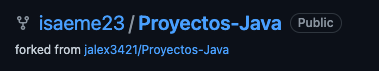

# Parcial CVDS 2022-2
## Integrantes
Santiago Ospina, Isabella Manrique
## Git
Este proyecto fue tomado del siguiente repositorio en [GitHub](https://github.com/jalex3421/Proyectos-Java/tree/master/Supermercado)
1. Realizamos el fork, que es una copia del repositorio en nuestro usuario 
y que no se encuentra en lazado al repositorio original, por lo que nos permitirá
realizar cambios.

## Indentificar de malas prácticas
## Unit Test y malas prácticas
## Patrones de diseño